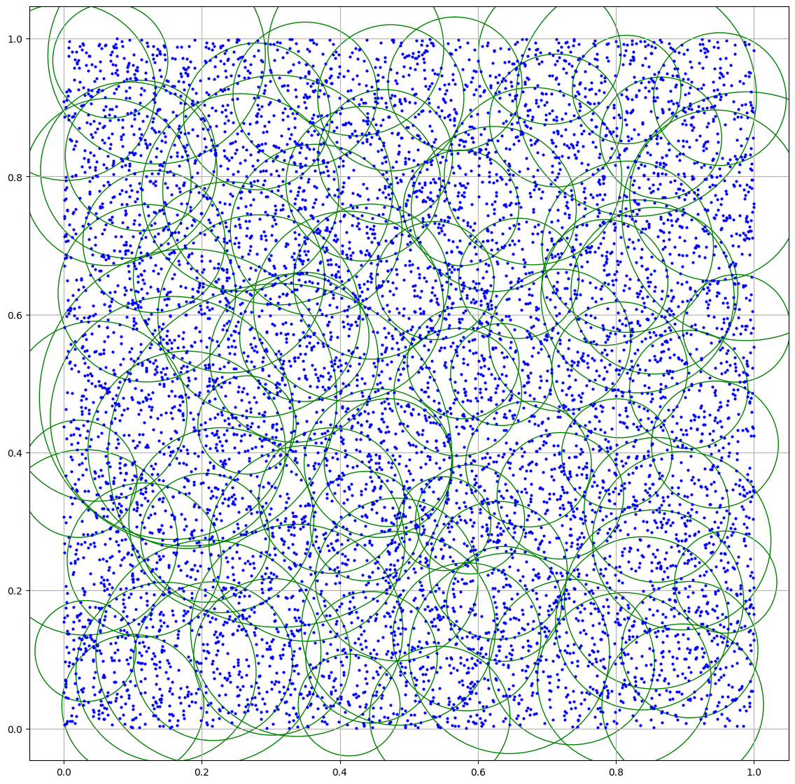
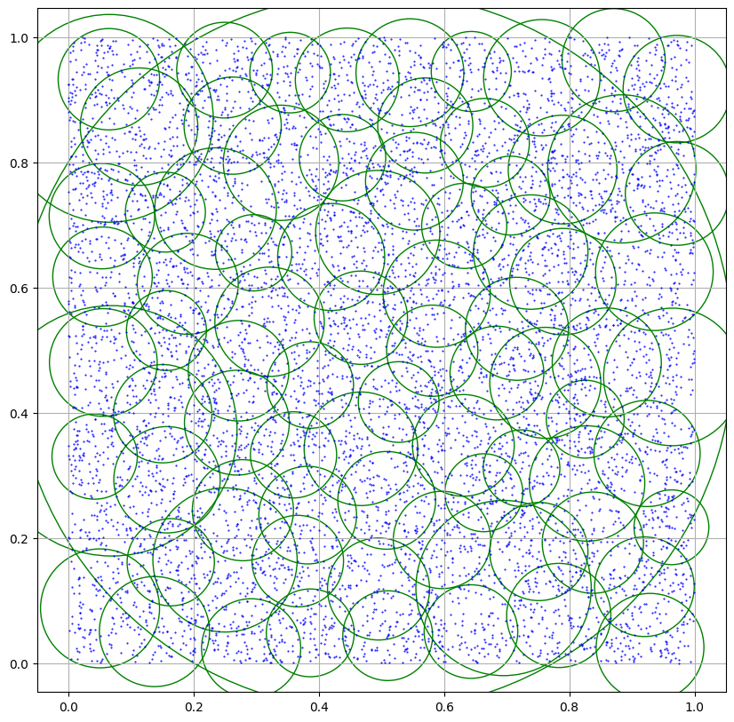

# MTree
El M-Tree12 es un método de acceso métrico dinámico, que consiste en un árbol balanceado.

### Ejecutar
El proyecto se construyo en un sistema operativo con linux y se utilizo
la funcionalidad "make" para la compilación y ejecución del proyecto.  
Por lo anterior, es necesario tener la funcionalidad "make" para ejecutar los test.

Los comandos para ejecutar la tarea son:

    make run
    make test

#### run
Ejecuta el archivo "main", que contiene un test de uso básico para un MTree.  
Permite crearlo y realizar consultas al MTree creado.   
Modificar este archivo con aquello que se quiera realizar.

#### test
Ejecuta el archivo "test", que contiene el código utilizado para la experimentación.  
Crea un MTree utilizando ambos métodos y realiza 100 consultas con el MTree creado.
Esto lo hace para $n \in \{2^{10},...,2^{25}\}$, siendo n el tamaño del conjunto 
de puntos que se utiliza para la creación del MTree.  
Además, el archivo "test" escribirá las pruebas realizadas en la carpeta ./resultados

### Resultados

Los resultados de la experimentación se encuentran disponibles en el archivo read.ipynb, 
el cual lee los archivos generados por "test" para generar gráficos y figuras con la información
obtenida.

### Algunos resultados 

Que el poder de Navarro te acompañe.