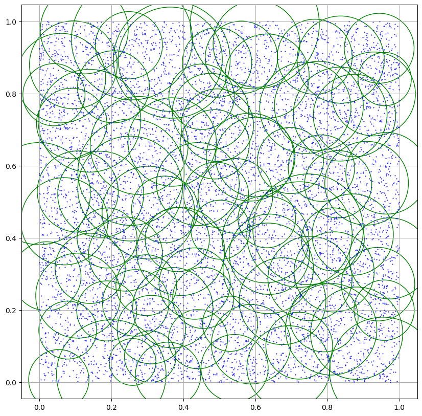
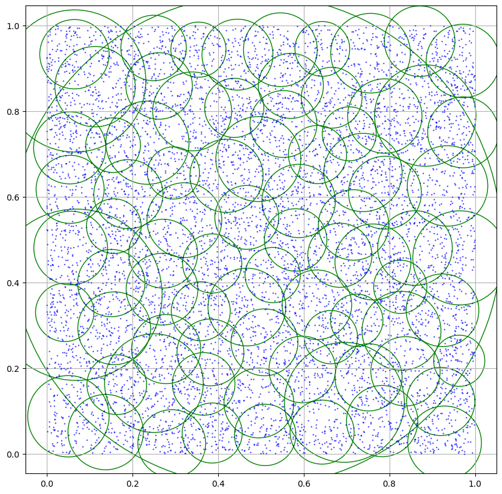

# MTree

The M-Tree is a dynamic metric access method, consisting of a balanced tree.

## Running the Project
### Required!
The project was built on a Linux operating system and used the "make" functionality for compiling and running the project.  
Therefore, it is necessary to have the "make" functionality to run the tests and the main program.

### Commands to run the project

    make run
    make test

### make run
Compiles and runs the "main" file, which contains a basic usage test for an M-Tree.  
It allows creating and querying the created M-Tree.  
This is the file for normal use of the M-Tree.

### make test
Compiles and runs the "test" file, which contains the code used for experimentation.  
It creates an M-Tree using both methods and performs 100 queries with the created M-Tree.  
This is done for $n \in \{2^{10},...,2^{25}\}$, where n is the size of the point set used to create the M-Tree.  
Additionally, the "test" file will write the tests performed to the ./results folder.

## Project Structure    

     MTree
    ├──  build
    │   ├──  main
    │   ├──  test
    ├──  headers
    │   ├──  mtree.hpp
    │   ├──  point.hpp
    │   └──  utils
    │       ├──  closest_pair.hpp
    │       └──  random.hpp
    ├──  Makefile
    ├──  README.md
    ├──  results
    │   ├──  img/
    │   ├──  Informe.pdf
    │   ├──  results.pdf
    │   ├──  cp/
    │   └──  ss/
    └── 󱧼 src
        ├──  main.cpp
        ├──  mtree
        │   ├──  mtree.cpp
        │   ├──  mtree_create_cp.cpp
        │   ├──  mtree_create_ss.cpp
        │   └──  point.cpp
        ├──  test.cpp
        └──  utils
            ├──  closest_pair.cpp
            └──  random.cpp

## Resultados
Los resultados de la experimentación se encuentran disponibles en la carpeta ./results.

### Algunos resultados 

#### Método Ciaccia-Patella 

#### Método Sexton-Swinbank 

